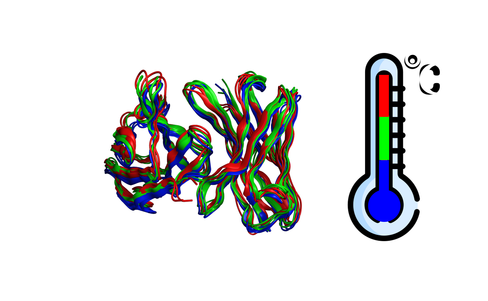

# AbMelt
The AbMelt protocol is described below. The input only requires pdb files of antibody Fvs (e.g., experimental, MOE homology, ImmuneBuilder, etc.). Regressors from the manuscript are provided to run inference on computed MD descriptors and predict T<sub>agg</sub>, T<sub>m,on</sub>, and T<sub>m</sub>.



## requirements
- [GROMACS](https://manual.gromacs.org/documentation/current/install-guide/index.html) needs to be installed to complete MD simulations
- [MOE](https://www.chemcomp.com/) is utilized in manuscript ([contact CCG](https://www.chemcomp.com/Download_Request.htm) for license)
- [ImmuneBuilder](https://github.com/oxpig/ImmuneBuilder) is an open source alternative to MOE for Fv generation (implemented in section I. sequence to structure)
- conda environments needs to be created to perform MD simulations, compute MD descriptors, select descriptors, and regress ML models
	- separate conda environments needs to be created to compute descriptors and perform ML regression/inference (due to [RAPIDS](https://docs.rapids.ai/install) dependencies)
	- conda environments have been built in Linux CentOS 7.8+ (other platforms have not been tested)
  
```
    conda env create --file=abmelt.yml
    conda env create --file=rapids.yml
```
## data availability
- data for the AbMelt train set and test sets is provided: 'data/'
 ```
/data/tagg/tagg_final.csv
/data/tagg/holdout.csv
/data/tmon/tmon_final.csv
/data/tmon/holdout.csv
/data/tm/tm_final.csv
/data/tm/holdout.csv
```
- cross-validation results of the AbMelt trained regressors are provided: 'cross_validation/'
- data, models, and cross-validation for MOE baselines is provided: 'moe_ml/'
- additional T<sub>m</sub> regressors trained on pulbic Jain et al. T<sub>m</sub> data, Jain et al. + Shehata et al. T<sub>m</sub> data, and Internal T<sub>m</sub> data
	- all MD descriptors and T<sub>m</sub> values are provided: 'public_tm/*csv'
 	- all pdbs from Jain et al. + Shehata et al. are provided to reproduce MD descriptors: 'public_tm/train_pdbs' & 'public_tm/test_pdbs'
  	- random forest model weights are provided to run T<sub>m</sub> inference: 'public_tm/trained_regressors/*pkl'  		

## inference for T<sub>agg</sub>, T<sub>m,on</sub>, and T<sub>m</sub>
- inference can be run on csv files containing the descriptors used to train the regressors
- trained regressors are located in their rescpective directory: models/
```
conda activate rapids
python ./train_test_predictors/prediction.py -holdout="holdout.csv" -models="all" -rescaled=False
```

## AbMelt protocol
### I. sequence to structure
Prefence should be to use experimental structures. We used the Antibody Modeler application in MOE for the manuscript. We are reasonably confident that the MD simulations will smooth over <2 Å structure errors (over Fv C<sup>α</sup> coordinates, see Figure S7) known to occur in approximated structures (e.g., MOE, ImmuneBuilder, etc.). Be sure to energy minimize any approximated structure. We provide an open source alternative to MOE Fv structure generation using ImmuneBuilder. We also provide the starting pdb for the public antibody sequences 'data/*.pdb' used in the manuscript.

- [Experimental RCSB](https://www.rcsb.org)
- [MOE](https://www.chemcomp.com/)
	1. input sequence fasta file with variable fragment (Fv) into MOE
  	2. homology model by running MOE Antibody Modeler Application (default settings)
- [ImmuneBuilder](https://github.com/oxpig/ImmuneBuilder)
```
conda activate abmelt
python ./src/structure.py --h='H_SEQ' --l=L_SEQ' --output='mAb.pdb'
```


### II. structure to multi-temperature MD trajectories to AbMelt descriptors
	1. calculate residue-level pKa of MOE homologs using propKa 3.1
	2. convert pdb to gromacs structure and topology files using pdb2gmx
	3. protonate residues with pKa < 7.4
	4. select force field (CHARMM27) parameterize simulation
	5. solvate with ions to neutralize charge and reach physiological salt concentration with ions.mdp
	6. energy minimize using em.mdp
	7. perform nvt simulation using nvt.mdp @ 300K, 350K, 400K
	8. perform npt simulation using npt.mdp @ 300K, 350K, 400K
	9. perform md simulation using md.mdp @ 300K, 350K, 400K
	10. define structure index groups with gmx_ndx by identifying CDR regions with IMGT numbering scheme
	11. compute gromacs descriptors for trajectories (gmx_hbond, gmx_sasa, gmx_rmsf, etc.) using analyze.sh and analyze_cdrs.sh
	12. compute k-SASA and order parameter (MD-Analysis MD-traj python packages) using s2.py and sasa.py
- AbMelt automation has been implemented with [.gromacswrapper](https://gromacswrapper.readthedocs.io/en/latest/)
	1. mdp files will need to be stored in '.gromacswrapper/templates/'
	2. pbs array job submission script provided '.gromacswrapper/qscripts/arr.sh'
	3. pathway to GROMACS executable needs to be specifed in moe_gromacs.py 
  ```
    conda activate abmelt
   
    # run AbMelt, fix trajectories, analyze all descriptors
    python ./src/moe_gromacs.py --project 'AbMelt' --dir 'mAb_name' --temp '300, 350, 400' --ff 'charmm27' --md
    python ./src/moe_gromacs.py --project 'AbMelt' --dir 'mAb_name' --temp '300, 350, 400' --ff 'charmm27' --fix_trj 
    python ./src/moe_gromacs.py --project 'AbMelt' --dir 'mAb_name' --temp '300, 350, 400' --ff 'charmm27' --analyze
   
    # help with AbMelt specifications
    python ./src/moe_gromacs.py --help
	options:
	  -h, --help            show this help message and exit
	  --project PROJECT     specify project directory with subdirectories containing pdb files (e.g., AbMelt)
	  --dir DIR             specify subdirectory to execute MD simulations (should be specified by the pbs array)
	  --pH PH               specify pH to determine protonation states of histidines with propka3
	  --p_salt P_SALT       specify ion to add to system (e.g., "NA+", "K+", "MG2+", "CA2+")
	  --n_salt N_SALT       specify ion to add to system (e.g., "CL-")
	  --conc_salt CONC_SALT
	                        specify salt concentration in mM (e.g., PBS ~150 mM)
	  --temp TEMP           specify temperatures to run 100 ns MD simulations as string separated by commas (e.g., "300, 350, 400")
	  --md                  run md simulations for default 100 ns
	  --time TIME           specify time to run md simulations in ns if different than 100 ns (e.g., 500) or evaluate after 100 ns and extend simulations with --ext
	  --ff FF               specify force field to use for md simulations (e.g., "charmm27, charmm36-jul2022, amber03, amber94, amber96, amber99, amber99sb, amber99sb-ildn, amberGS, oplsaa, gromos43a1, gromos43a2, gromos45a3, gromos53a5, gromos53a6, gromos54a7")
	  --water WATER         specify water model to use for simulations defaulted to tip3p (e.g., "CHARMM > tip3p, AMBER > tip3p or tip4p, GROMOS > spc or spc/e, OPLS--> tip3p or tip4p")
	  --ext EXT             extend md simulations in ns
	  --fix_trj             remove periodic boundary conditions from md trajectories
	  --analyze             compute descriptors from AbMelt methodology on md trajecotries
	  --eq_time EQ_TIME     specify equilibration time in ns to remove from analysis

### III. descriptor selection to train ml regressors
	1. organize calculated descriptors into csv with provided format in holdout.csv
	2. run ray_cpu_cluster.sh
	3. first bash script collects cpu nodes as specified in the PBS command utilizing ray distributed
	4. second executes descriptor selection (recursive and exhaustive) by running rf_rfs.py and rf_efs.py
	5. third executes ml regressor training with skopt bayesian optimzation by runnung predictors.py 
- AbMelt automation of descriptor selection and regression utilzes several libraries
- compute can be accelerated using RAPIDS implementation of scikit-learn regressors
- compute can be distrubted using ray distributed
- bayesian optimization on hyperparameter space is implemented with skopt
	```
	conda activate rapids
	
	# run recursive and exhaustive feature selection over descriptors
	python ./train_test_predictors/rf_rfs.py -input="tagg_final.csv" -corr_max=0.95 -cv_splits=3 -cv_repeats=3
	python ./train_test_predictors/rf_efs.py -input="rf_ranked_features.csv" -n_efs=5 -cv_splits=3 -cv_repeats=3
	
	# train regressors with selected descriptors
	python ./train_test_predictors/predictors.py -input="rf_efs.csv" -mode="efs" -scoring="mae" -cv_splits=18 -cv_repeats=3 -bopt_iters=500 -bopt_points=4
	
	# help with AbMelt regressor training options
	python ./train_test_predictors/predictors.py --help
		optional arguments:
		  -h, --help            show this help message and exit
		  -input INPUT          {default = "train.csv"}; csv file for model prediction (features[:,1:-1], target[:,-1])
		  -mode MODE            {default = "afs"}; mode for building predictors (afs, rfs, efs, or any prefix for naming output files)
		  -scoring SCORING      {default = "r2"}; scoring metric for model evaluation (r2, mae, mse)
		  -scale_features SCALE_FEATURES
		                        {default = None}; scale features for prediction (avg_std, med_iqr, min_max)
		  -cv_splits CV_SPLITS  {default = 5}; number of random cross validation folds
		  -cv_repeats CV_REPEATS
		                        {default = 3}; repeats of cv_splits
		  -bopt_iters BOPT_ITERS
		                        {default = 50}; iterations of skopt bayesian optimization on model hyperparameter space
		  -bopt_points BOPT_POINTS
		                        {default = 4}; number of hyperparameter points per bopt_iter
		  -n_jobs N_JOBS        {default = None}; number of parallelized jobs (max per iteration = cv_splits * cv_repeats * bopt_points)
		  -n_gpus N_GPUS        {default = 0}; RAPIDS cuML GPU acceleration (1 for acceleration)
	```
## reference

```
@article{rollins2024,
        title = {{AbMelt}: {Learning} {antibody} {thermostability} from {molecular} {dynamics}},
        journal = {preprint},
        author = {Rollins, Zachary A and Widatalla, Talal and Cheng, Alan C and Metwally, Essam},
	url = {},
        month = feb,
        year = {2024}}
```
